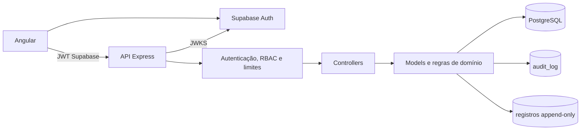
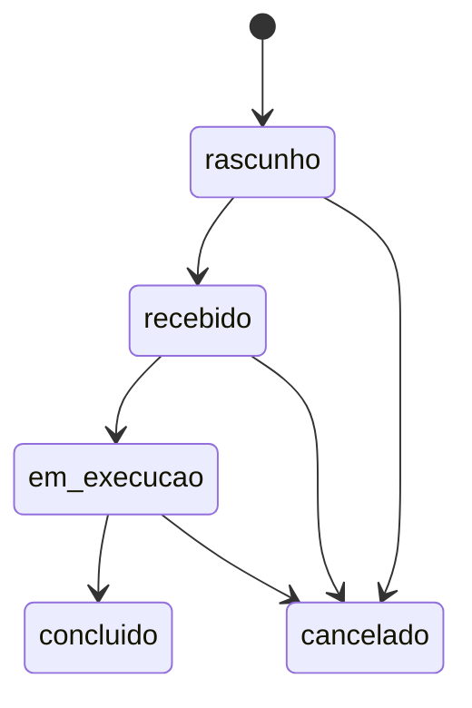
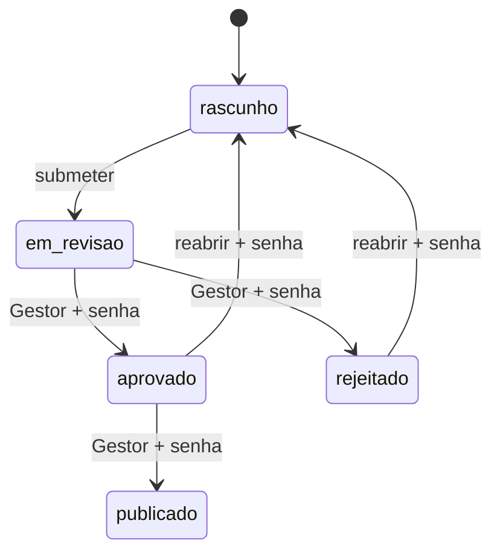

# Arquitetura do SYSmLab

## Escopo de implantação

O SYSmLab usa uma instalação por laboratório. O esquema não possui `tenant_id` nem isolamento entre organizações; portanto, laboratórios independentes não devem compartilhar o mesmo banco ou projeto Supabase.

O frontend usa Supabase apenas para sessão. O acesso aos dados de negócio ocorre pela API; tabelas do domínio têm RLS habilitado e permissões diretas removidas de `anon` e `authenticated`.

## Camadas

- `routes/`: contrato HTTP, upload, rate limit específico e autorização por perfil.
- `controllers/`: orquestração de requisição/resposta e mapeamento de erros.
- `models/`: SQL parametrizado, transações e invariantes do domínio.
- `services/SignatureService.js`: reautenticação isolada, com chave Publishable, timeout e sem persistir senha/token.
- `utils/conformidade.js`: avaliação central de conformidade legal/operacional.
- `utils/canonicalJson.js`: serialização determinística usada em hashes de assinatura e laudo.
- `middleware/`: JWT/JWKS, RBAC, status terminais e limites por usuário.
- `supabase/migrations/`: esquema versionado, restrições, triggers de imutabilidade e catálogo legal.

## Módulos de domínio

| Módulo | Entidades e responsabilidade |
|---|---|
| Comercial | `cliente`, `pedido_analise`; origem comercial, solicitante, prazo, prioridade e ciclo do pedido |
| Amostras | `amostra`, `amostra_parametro`, `amostra_custodia_evento`; escopo esperado, estado e custódia |
| Métodos | `metodo_analitico`; código/versão, referência, LD/LQ, incerteza e aplicabilidade |
| Resultados | `resultado_analise`, `resultado_versao_snapshot`, `resultado_workflow_evento`, `assinatura_eletronica`; medição, contexto congelado, revisão e publicação |
| Laudos | `laudo_analitico`; snapshot imutável, versão, assinatura de emissão e hash SHA-256 |
| Inventário | `insumo`, `insumo_lote`, `estoque_movimentacao`; disponibilidade, validade e razão de saldo |
| Equipamentos | `equipamento`, `equipamento_evento`, `equipamento_utilizacao`; calibração, manutenção e uso rastreável |
| QMS | `qms_ocorrencia`, `qms_acao_capa`; não conformidade/desvio, investigação, CAPA e eficácia |
| Governança | `audit_log`, `usuario`; identidade, perfis e histórico transversal |

## Fluxos e invariantes

### Pedido e amostra

- O cliente deve estar ativo ao criar/editar o pedido.
- Depois da primeira amostra, o cliente do pedido fica congelado.
- Pedido só conclui quando possui amostras e todas estão concluídas.
- Pedido não é cancelado enquanto houver amostras não terminais.
- A amostra só aceita parâmetros ativos da matriz escolhida; resultado fora do seu escopo é rejeitado.
- Mudanças de custódia são append-only, validam origem/destino e limitam retroatividade.

### Resultado e assinatura

- Um único resultado ativo pode existir por amostra/parâmetro.
- A edição só ocorre no estado permitido e cria versão/snapshot analítico.
- O método é obrigatório para submissão e deve ser aplicável à matriz/parâmetro.
- Quem submeteu não pode aprovar nem rejeitar a mesma versão; a separação é obrigatória na aplicação e no banco.
- Aprovação, rejeição, publicação e reabertura usam reautenticação; apenas evidência, hash e metadados são gravados.
- Resultado publicado é imutável e é o único considerado em dashboards/laudos.
- A amostra só conclui quando o conjunto exato de parâmetros esperados possui resultados publicados.

### Laudo

Uma emissão reúne, na mesma transação, amostra concluída, conjunto completo de resultados publicados, cliente/pedido, identidade do laboratório configurada no servidor e usuário emissor. O snapshot é serializado canonicamente, recebe SHA-256 e é vinculado à assinatura `REPORT_ISSUE`. Cada nova emissão cria uma versão; não existe atualização ou exclusão de laudo.

O QR aponta ao frontend público, que consulta somente metadados mínimos de autenticidade. A resposta pública não contém cliente, identificadores da amostra nem resultados.

### Inventário, equipamentos e QMS

- Movimentações de estoque não são editadas/apagadas; uma correção é um ajuste compensatório de Gestor.
- Consumo é bloqueado sem saldo, para lote indisponível ou vencido.
- Uso de equipamento é append-only e só pode ser registrado quando ele está disponível, sem calibração vencida ou intervenção ativa.
- Evento de equipamento concluído/cancelado é imutável; reprovação bloqueia o equipamento.
- QMS aplica transições explícitas, exige causa raiz antes do plano, ações concluídas antes da verificação e evidência de eficácia antes do encerramento.

## Transações, concorrência e retenção

Operações que alteram estado usam transação e bloqueio de linha (`FOR UPDATE`) quando necessário. Restrições e índices parciais protegem invariantes também contra concorrência. Registros críticos são retidos por arquivamento lógico ou por tabelas/triggers append-only.

`audit_log` registra ator, request ID, antes/depois e metadados. Auditoria é uma evidência técnica; procedimentos do laboratório ainda devem definir revisão, retenção, exportação e acesso.

## Evolução arquitetural

- Adotar validação declarativa de payloads e gerar testes de contrato a partir do OpenAPI.
- Extrair serviços de domínio maiores dos models SQL e padronizar todos os envelopes de erro/listagem.
- Adotar fila persistente para importações extensas, notificações e geração/armazenamento de PDF.
- Expor métricas e traces além dos logs JSON; integrar alertas operacionais.
- Implementar storage imutável e assinatura/certificado digital quando o requisito regulatório exigir documento PDF assinado.
- Para SaaS compartilhado: projetar `tenant_id`, RLS, chaves compostas, storage segregado e testes automáticos de isolamento antes de qualquer compartilhamento de infraestrutura.

## Regra de contribuição

Toda alteração de dado laboratorial deve incluir autorização, validação, transação, auditoria, teste da regra e atualização do contrato. Mudanças em limites ou métodos exigem fonte, vigência, contexto e versão; conteúdo já utilizado não deve ser alterado retroativamente.
